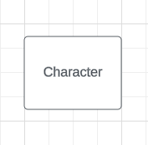
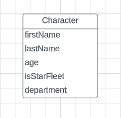
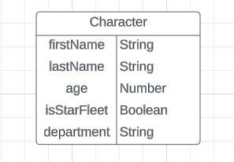

# An Introduction to Mongoose

This talk is going to assume you have the following installed:

- [Visual Studio Code](https://code.visualstudio.com/)
- [Node.js](https://nodejs.org/en)

This talk uses:

- [MongoDB Atlas](https://www.mongodb.com/products/platform/cloud)

This talk expects you to have a base knowledge of:

- CLI
- JavaScript
- [MongoDB](https://github.com/ejparnell/intro-to-mongodb)

## Overview

Okie dokie, artichokes, let's come together and talk about [Mongoose](https://mongoosejs.com/). This talk will cover the following:

## Data Modeling

Before we can talk about Mongoose we need to talk about data modeling. So what is data modeling? Data modeling is how we define our datas structure provding a way to represent real-world entities, relationships, and attributes. Let's take a look at some key concepts of data modeling:

- Entities - Object or concepts in the real world that need to be represented in the database.
- Attributes - Properties or characteristics of enitities.
- Relationships - Describes how the enitities are related to one another.
- Constraints - Rules around data being inserted into the database.

There are a couple of different types of data modeling one can do. For this talk we are going to focus on logical data modeling. A logical data model is a data model that has entities, their attributes, and the relationships between the entities.

### ERDs

ERDs, or enitity relationship diagrams are a tool that data modelers use to model data. Let's model something to get a feel of how to build an ERD.

We first need a real world item that we want to model; let's say characters from the TV show Star Trek: Deep Space Nine.

1. What is the name of the enity we are modeling?

Names of enities should be the non pulural version of a word. Enities names should also have the first letter capitalized. This represents that this is a class and that there are going to be many instances on this enity.

We are modeling characters from the TV show Star Trek: Deep Space Nine. We are going to use the non plural version of characters, character, and then capitlize the first letter, Character.



At the most basic an ERD is just a simple diagram with a square box and a label in the box that let's the user know what enity it represents.

2. What attributes do we want to track in our enity?

These are going to be our fields for our documents. Here is a good idea to think through your application and see what data you will need to store.



- firstName - Will hold the first name of the character.
- lastName - Will hold the last name of the character.
- age - Will hold the age of the character.
- isStarFleet - Will show is this character is in Star Fleet or not.
- department - Will show which department this character works in.

These are the attributes we want to track in this talk for a single character.

3. What value are these attributes going to hold and what, if any, rules do we want to put around them for validation?

We have five attributes that we want to track for this talk. But what value should these attributes hold? We want to think of this in the abstract and not put in actual values. Remember this is going to be a template for all documents in a collection.



We can see that `firstName`, `lastName`, and `department` fields are expecting string values, `age` is expecting a number value, and `isStarFleet` is expecting a boolean value.

> *Note*: We will be adding a relationship later, but since we just have a single enity we are not going to diagram that relationship here. However we will diagram that relationship later in this talk.

## Mongoose

Mongoose is a database middleware for MongoDB that simplifies our interactions. If you followed along with my last talk [Intro to MongoDB](https://github.com/ejparnell/intro-to-mongodb) you know a couple of things about MongoDB:

- NoSQL document-orientated data database that allows us to store loosely related documents in collections.
- Does not require predetermined schemas for it's documents.
- Can use collection methods for CRUD operations.
- Stores documents as BSON objects.

So where does this Mongooese come into play? Since our documents do not require a predetermined schema we can have documents that have different field/value pairs. Let's take a look at an example of a collection in MongoDB:

```js
{
        name: 'Captian Benjamin Sisko',
        age: 43,
        isStarFleet: true,
    },
    {
        name: 'Odo',
        age: 11,
    },
    {
        name: 'Colonel Kira Nerys',
        age: 26,
    },
    {
        name: 'Quark',
        age: 36,
    }
```

Only the document with the field/value pair of `name: 'Captian Benjamin Sisko'` has the `isStarFleet: true,` field/value pair. MongoDB is totally fine with this. There is another thing that we have to worry about here as well. By default there is nothing stopping us from storing a number or boolean value in the `name` field. We could use MonogDB and set a predefined structure, making sure that all documents have the same field/value pairs and those field/value pairs have the expected data type. But here is where Mongoose makes our life easier. From the [Mongoose home page](https://mongoosejs.com/):

**Let's face it, writing MongoDB validation, casting and business logic boilerplate is a drag. That's why we wrote Mongoose.**

Using Mongoose will make our lifes easier when we are wanting to write validations, casting, and business logic in MongoDB.

## Mongoose Schemas

We should always start with a schema. What is a schema though? A schema is a blueprint that defines the structure of a MongoDB document in a collection. Here is where we take those data modeling skills from the above section and translate them to code.


We have this abstract Character enity with field/value pair. Let's translate that into JavaScript and implement the Mongoose library.

First always reference the documentation. Let's take a look at what a `Schema` is expecting. From the [Mongoose Guide](https://mongoosejs.com/docs/guide.html#definition):

```js
const blogSchema = new Schema({
  title: String, // String is shorthand for {type: String}
  author: String,
  body: String,
  comments: [{ body: String, date: Date }],
  date: { type: Date, default: Date.now },
  hidden: Boolean,
  meta: {
    votes: Number,
    favs: Number
  }
});
```

They are using a blog as their enity they are modeling. The first parameter they are passing in is an object with key/values pairs that represent the field/value pair we want our documents to have in our collection.

But why the capital `S` with `String` or the capital `B` with `Boolean`? Does that matter? Yes it does! These are not just some arbitary value we are passing in these are [SchemaTypes](https://mongoosejs.com/docs/schematypes.html). SchemaTypes are built in object for Mongoose models, used to validate field/value pairs. Meaning that if we have declared `title`'s value should always be a string, and if we try to create a document with a number value in the `title`'s field we will get a validation error and the document will be prevented from being inserted.

The one thing that is not being represented here in this example but we need to know in order is the options. We can pass an optional second parameter to the `Schema` class. This is where we can turn on options for our documents. One option that we should always turn on is timestamps. We will talk about this more later.


Let's take these learnings from above and set up a  Charater Schema. Inside of `bin/models/character.js`:

```js
const mongoose = require('mongoose')

const { Schema } = mongoose

const characterSchema = new Schema({}, {})
```

- `const mongoose = require('mongoose')` - Requiring in the Mongoose library and saving it to a variable for easy use.
- `const { Schema } = mongoose` - We need the class of `Schema` so we can construct what our schema will look like.
- `const characterSchema = new Schema({}, {})` - Using the JavaScript keyword `new` we are creating a new instance of the schema class and calling it `characterSchema`.

In the above example we are passing the Mongoose Schema class two empty objects. The first empty object we are going to fill with our field/value pairs. The second, is optional and is for any options we want to use for these documents.

We have our Character Schema set up we can now take those attributes we specified in our ERD above and apply them here. Back inside of `bin/models/character.js`:

```js
const mongoose = require('mongoose')

const { Schema } = mongoose

const characterSchema = new Schema({
    firstName: String,
    lastName: String,
    age: Number,
    isStarFleet: Boolean,
    department: String
}, {})
```

We have filled in that first parameter's object with our field/values pairs. Making sure to match the types with what is in our ERD. Let's start to take a look at that second parameter now. Like I said above this is where we can turn on options for our documents. One option that we should always turn on is timestamps. But what are timestamps? Time stamps are a field/value pair that is added to each of our documents on creation. This will include the creation time and once we update it, it will include the last time we updated that document. More on timestamps [here](https://mongoosejs.com/docs/guide.html#timestamps).

Let's turn on timestamps. Back in `bin/models/character.js`:

```js
const mongoose = require('mongoose')

const { Schema } = mongoose

const characterSchema = new Schema({
    firstName: String,
    lastName: String,
    age: Number,
    isStarFleet: Boolean,
    department: String
}, {
    timestamps: true
})
```

By default timestamps are not turned on so in the options parameter we just have to send instructions to turn it on: `timestamps: true`.

> *Note*: Full list of all options we can use in Mongoose is [here](https://mongoosejs.com/docs/guide.html#options)

## Mongoose Validation

As of right now we have a basic schema with no added validation. The only validation we have is making sure this if we insert a field we have declared that it is checked to be the correct data type. Right now we could create documents without any of these fields because none of them are required. Let's fix that. Back in `bin/models/character.js`:

```js
const mongoose = require('mongoose')

const { Schema } = mongoose

const characterSchema = new Schema({
    firstName: {
        type: String,
        required: true
    },
    lastName: {
        type: String,
        required: true
    },
    age: {
        type: Number,
        required: true
    },
    isStarFleet: {
        type: Boolean,
        required: true
    },
    department: {
        type: String,
        required: true
    },
}, {
    timestamps: true
})
```

We first get rid of whatever was after our field declartion and add an object. In this object we still need to declare what type this field is going to hold. Next we use the `required` [built-in Mongoose validator](https://mongoosejs.com/docs/validation.html#built-in-validators) to make sure that a fields value is there when we try to create it.

We will break down just the `firstName` field/value pair:

- `type: String` - The type of value being stored in this field.
- `required: true` - Using the built-in Mongoose validator to make that this field is there on creation.

> *Note*: `required: true` is not required for Mongoose documents. You can leave this valiation off of the schema without causing any errors. However if you do you can create documents that missing field/value pairs. This might cause errors later in your application if you are expecting your data to be uniform.

The `required` built-in validator can be used on all SchemaTypes but Numbers and Strings have some other built-in validators that can only be used in that SchemaType.

Let's take a look at some of the [Numbers built-in validators](https://mongoosejs.com/docs/schematypes.html#number-validators): `min` and `max`.

- `min` - Declares the minumum value that can be stored at this field.
- `max` - Delcares the maxiumn value that can be stored at this field.

Back inside of `bin/models/character.js` let's update or `age` field to use these built-in validators:

```js
// Still inside of the Schema
age: {
        type: Number,
        required: true,
        min: 1,
        max: 100
    }
```

Right under that univeral built-in validator of `required` we can delcare that the minumumn value (`min`) for age can be 1, so no negitive numbers; and the maximumn value (`max`) is set to 100. We have now made sure that this age field/value pair is required, and can only be a number value from 1 to 100. Pretty neat!

Now on to some of our [string built-in validators](https://mongoosejs.com/docs/schematypes.html#string-validators). We have `enum`, `lowercase`, `trim`, `minLength`, and `maxLength`.

- `enum` - A preditermined array of values this string can be.
- `lowercase` - Calls `.toLowerCase()` on the value.
- `minLength` - Checks the length of the string and verifies that it meets the minumn legth we specify.
- `maxLength` - Checks the length of the string and verifies that it is not over the maxiumn lenght we specify.

Back inside of our `bin/models/character.js` let's update some of the string fields to use some of these built-in validators:

```js
    firstName: {
        type: String,
        required: true,
        trim: true,
        lowercase: true,
        minLength: 1,
        maxLength: 100
    },
    lastName: {
        type: String,
        required: true,
        trim: true,
        lowercase: true,
        minLength: 1,
        maxLength: 100
    },
// age and isStarFleet are still here but we are not changing those values right now
    department: {
        type: String,
        required: true,
        trim: true,
        lowercase: true,
        enum: ['command', 'security', 'medical']
    }
```

We are using `trim` and `lowercase` across all of our string fields to make sure our strings are consistant. We are also using the `minLength` and `maxLength` validators on our name fields. Lastly let's break down that `enum` field on the `department`.

We are saying here that the `department` field can only be one of three values: command, security, and medical. These are case sensitive as well so sense we are running the `lowercase` validator these values will need to be lowercase as well.

> *Note*: If the built-in validators are not enough for your application you can always create a [custom validator](https://mongoosejs.com/docs/validation.html#custom-validators).

## Mongoose Virtuals

We have a schema that has some validation now let's talk about virtuals. But what are these virtuals I speak of? Virtuals are document properties that we can get or set but do not persist in the database. Why would this be of value? Don't we want to persist all of our data? Well yes and no. We only want to presist data that we cannot construct from other data. 

In this example we have documents that include the persons first and last name. We can construct a full name from these two values. When dealing with a small data set in a personal project we do not have to be mindful of space. However when dealing with a large data set in a production application we want to be mindful of space. If our data becomes to large we will have to pay more for our database. So we want to be mindful of what we are storing in our database.

We can use Mongoose virtuals in two ways:

- Getters - We can use virtuals to get data from our documents.
- Setters - We can use virtuals to set data on our documents.

We are going to demo off both 

Let's add a virtual that will get a documents full name. Back inside of our `bin/models/character.js`:

```js
characterSchema.virtual('fullName').get(function () {
    return `${this.firstName} ${this.lastName}`
})
```

First we declare which schema or documents we want this virtual attached to. Here it's the `characterSchema` so our character documents will have access to this `fullName` functionality. Using the [`virtual`](https://mongoosejs.com/docs/api/schema.html#Schema.prototype.virtual()) method we name our virtual `fullName` and then use the [`get`](https://mongoosejs.com/docs/api/virtualtype.html#virtualtype_VirtualType-get) method to set the context of `this` to be an instance of a character document. Using dot notation we can then access the field/value pairs of that document. Using string interpollation we can then return the full name of that character.

## Mongoose Models

In order to interact with our Character Schema we created above we have to create a model. A Mongoose Model is a wrapper on the Mongoose Schema that gives us methods to interact with our database. We can create, read, update, and delete documents in our database using these methods. Let's create a model for our Character Schema. Back inside of `bin/models/character.js`:

```js
module.exports = mongoose.model('Character', characterSchema)
```

- `module.exports` - Exporting this model so we can use it in other files.
- `mongoose.model` - Calling the `model` method on the Mongoose library.
- `'Character'` - The name of the model. The name of our collection in our database will be based off of the string we pass in. It will be the lowercase version of the string and will be pluralized. So here our collection will be called `characters`.
- `characterSchema` - The schema we want to use for this model.

That is it! We now have a model that we can use to interact with our database.

## Connecting to our MongoDB Database via Mongoose

We have writen a lot of amazing code but we have not connected to our database yet. We will need to use the [`connect`](https://mongoosejs.com/docs/connections.html) method to connect to our MongoDB Cloud account. Inside of the `lib/connection.js` file:

```js
const mongoose = require('mongoose')
mongoose.connect(process.env.DATABASE_URI)

const db = mongoose.connection

module.exports = db
```

- `const mongoose = require('mongoose')` - Requiring in the Mongoose library and saving it to a variable for easy use.
- `mongoose.connect(process.env.DATABASE_URI)` - Calling the `connect` method on the Mongoose library and passing in the URI for our database.
- `const db = mongoose.connection` - Saving the connection to our database to a variable for easy use.
- `module.exports = db` - Exporting this connection so we can use it in other files.

But how are we going to run code against our database? We are going to use the [`readyState`](https://mongoosejs.com/docs/api/connection.html#Connection.prototype.readyState) along with [`connection events`](https://mongoosejs.com/docs/connections.html#connection-events) to open and close our database connection.

### Database URI

In the above code we are passing in `process.env.DATABASE_URI` to the `connect` method. This is an [environment variable](https://en.wikipedia.org/wiki/Environment_variable) that we are going to set in our `.env` file. Think of your `.env` file as a place to store all your secrets. You do not want to expose your database URI to the world. So we are going to store it in our `.env` file and then use the [dotenv](https://www.npmjs.com/package/dotenv) library to load it into our application. Let's set up our `.env` file. At the root of this project:

```bash
touch .env
```

Inside of our `.env` file:

```bash
DATABASE_URI=mongodb+srv://<username>:<password>@<cluster>/<database>?retryWrites=true&w=majority
```

- `DATABASE_URI` - The name of our environment variable.

Use the instructions provided by MongoDB [here](https://www.mongodb.com/docs/atlas/driver-connection/#connect-your-application) to get your database URI. Make sure to replace the `<username>`, `<password>`, `<cluster>`, and `<database>` with your information.

> *Note:* The database name that I would recommend for this guide is `deepSpaceNine` however feel free to name it whatever you want.

### Boilerplate Connection Code

Normally Mongoose is implemented in an Express application and with that enviroment we run our server and then connect to our database. However since we are not using Express we are going to have to do this a little differently. We are going to need some boilerplate code that will open a connection to our database, run our database interaction, then close our database connection. Let's take a look at that boilerplate code. Inside of `bin/actions/create.js`:

```js
const db = require('../../lib/connection')

db.on('open', () => {
    console.log('Connected to MongoDB')
    db.close()
})
```

- `const db = require('../../lib/connection')` - Requiring in our database connection.
- `db.on('open', () => {` - Listening for the `open` event on our database connection.
- `console.log('Connected to MongoDB')` - Logging out that we are connected to our database.
- `db.close()` - Closing our database connection.

Let's now run this file with Node. If successful there should be a slight pause in the terminal then the message will print. Let's run this file. At the root of this repository:

```bash
node bin/actions/create.js
```

## Mongoose CRUD

CRUD stands for create, read, update, and delete. These are actions we can take on our database, normally refered to as CRUD operations. In the following sections we are going to go over each of these operations and how to implement them using Mongoose. We are going to be using the following Mongoose Model methods to implement these operations:

- ['create'](https://mongoosejs.com/docs/api/model.html#Model.create())
- ['find'](https://mongoosejs.com/docs/api/model.html#Model.find())
- ['findById'](https://mongoosejs.com/docs/api/model.html#Model.findById())

Looking at the list above we can see that we have actions for creating and reading/finding but we don't have any actions for updating or deleting. We will be using the following [Mongoose Document middleware](https://mongoosejs.com/docs/middleware.html#types-of-middleware) to implement these operations:

- ['save'](https://mongoosejs.com/docs/api/model.html#Model.prototype.save())
- ['deleteOne'](https://mongoosejs.com/docs/api/model.html#Model.prototype.deleteOne())

### We do: Create

Our first action we are going to impletment is create. Refering to the documentation on [`create`](https://mongoosejs.com/docs/api/model.html#Model.create()) we can see that this method takes in two parameters:

- `docs` - An object or an array of objects to insert into the database.
- `options` - An optional object of options.

We will not be using the optional options object so we will only be passing in the `docs` parameter. Let's create a character. Inside of `bin/actions/create.js`:

```js
db.on('open', () => {
    console.log('Connected to MongoDB')

    const character = {
        firstName: 'Benjamin',
        lastName: 'Sisko',
        age: 43,
        isStarFleet: true,
        department: 'Command'
    }

    db.close()
})
```

We have created a character object that matches our schema. Let's now use the `create` method to insert this character into our database. Inside of `bin/actions/create.js`:

```js
const db = require('../../lib/connection')
// Require in the Character model
const Character = require('../models/character')

db.on('open', () => {
    console.log('Connected to MongoDB')

    const character = {
        firstName: 'Benjamin',
        lastName: 'Sisko',
        age: 43,
        isStarFleet: true,
        department: 'Command'
    }

    // Calling the create method on the Character model
    Character.create(character)

    db.close()
})
```

We required the Character model at the top of the screen and then inside out `db.on` method we are calling the `create` method on the Character model and passing in our character object. From here we have 2 options:

- Use Promises
- Use Async/Await

Both of these options pause our code and wait for the database to respond. This is called asynchronous code. We will be using promises for this talk. Let's take a look at how we can use promises to get the data we want. Inside of `bin/actions/create.js`:

```js
Character.create(character)
    // Because the create method returns a promise we can use .then
    // We are accepting the character as an argument in the annoymous function
    .then(character => {
        console.log('Created character', character)
    })
    // Because nothing is being returned from the previous .then method we will leave this argument blank
    .then(() => {
        db.close()
    })
    .catch(err => {
        console.error(err)
    })
```

Since the `create` method returns a promise we can use the `.then` method to get the data we want. The first `.then` method will return the character we created. The second `.then` method will close our database connection. The `.catch` method will catch any errors that might happen.

> *Note:* Some of the methods we will be using returns a [`Mongoose Query`](https://mongoosejs.com/docs/api/query.html). This is a class that has a [`.then`](https://mongoosejs.com/docs/api/query.html#Query.prototype.then()) method that returns a promise. In JavaScript this is called a thenable. More on using async/await in Mongoose [here](https://mongoosejs.com/docs/async-await.html).

Now that we have our create method set up let's run this file. At the root of this repository:

```bash
node bin/actions/create.js
```

We should see the following output:

```js
Connected to MongoDB
Created character {
  firstName: 'benjamin',
  lastName: 'sisko',
  age: 43,
  isStarFleet: true,
  department: 'command',
  _id: new ObjectId("65528c5f6c01a707ff3a0792"),
  createdAt: 2023-11-13T20:51:43.549Z,
  updatedAt: 2023-11-13T20:51:43.549Z,
  __v: 0
}
```

Your `_id`, `createdAt`, and `updatedAt` will differ from mine however the other values should be the same. We have now created a character in our database.

### You do: Create


### We do: Read


#### Index
#### Show
### You do: Read
### We do: Update
### You do: Update
### We do: Delete
### You do: Delete
